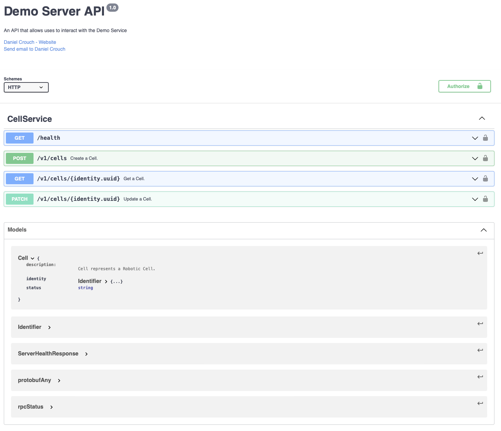

# gRPC and REST API Server (OpenAPI) 

This project demonstrates a RESTful HTTP API service over gRPC with an OpenAPI description.

Examples of server-side and client-side implementations have been included for reference.



---
## Usage

Start gRPC server. The terminal will block until the application is exited (Cntrl + C).

```bash
go run cmd/server/main.go
# 2022/04/02 22:46:13 SERVER_ADDR: 0.0.0.0
# 2022/04/02 22:46:13 SERVER_PORT: 8081
# 2022/04/02 22:46:13 PROXY_SERVER_PORT: 8080
# 2022/04/02 22:46:13 starting reverse-proxy server on 0.0.0.0:8080
```

Create a `cell` item with key `foo-cell`:

```bash 
go run cmd/client/main.go create cell foo-cell     
# connecting to server on 127.0.0.1:8081
# creating cell...
# identity:{uuid:"foo-cell"}  status:"offline"
```

Get the `cell` from the Server

```bash
go run cmd/client/main.go get cell foo-cell   
# connecting to server on 127.0.0.1:8081
# getting cell...
# identity:{uuid:"foo-cell"}  status:"online"
```

Update the `cell` to an `online` `status`:

```bash
go run cmd/client/main.go update cell foo-cell online
# connecting to server on 127.0.0.1:8081
# getting cell...
# updating cell...
# identity:{uuid:"foo-cell"}  status:"online"
```

Alternatively, access the `cell` resource via REST in a browser or with `curl`, for instance:
```bash
curl http://127.0.0.1:8080/v1/cells/foo-cell
# {"identity":{"uuid":"foo-cell"}, "status":"online"}
```


---
## Installation

Create `./tools` package to handle `grpc-gateway` build packages.

```go
// +build tools

package tools

import (
    _ "github.com/grpc-ecosystem/grpc-gateway/v2/protoc-gen-grpc-gateway"
    _ "github.com/grpc-ecosystem/grpc-gateway/v2/protoc-gen-openapiv2"
    _ "google.golang.org/grpc/cmd/protoc-gen-go-grpc"
    _ "google.golang.org/protobuf/cmd/protoc-gen-go"
)
```

Run go `mod tidy` to resolve the versions. Then install by running:

```bash
go get github.com/grpc-ecosystem/grpc-gateway/v2/protoc-gen-grpc-gateway
go install github.com/grpc-ecosystem/grpc-gateway/v2/protoc-gen-openapiv2
go install google.golang.org/protobuf/cmd/protoc-gen-go 
go install google.golang.org/grpc/cmd/protoc-gen-go-grpc
```

This will place four binaries in your `$GOBIN`;

protoc-gen-grpc-gateway
protoc-gen-openapiv2
protoc-gen-go
protoc-gen-go-grpc

Make sure that your $GOBIN is in your $PATH:

```bash
export PATH="$PATH:$(go env GOPATH)/bin"
```

---
## Generate Data Classes and gRPC Services (Server-Client) 

By default, gRPC uses Protocol Buffers for serializing structured data. The structure of the data to be serialised, generated data access classes and services are defined in a `.proto` file definition.

Protocol buffer data is structured as messages:

```
message Cell {
  Identity Identity = 1;
  string Status = 2; 
}
```

gRPC services use RPC method parameters and return types specified as protocol buffer messages:

```
service CellService {
  rpc GetCell (IdMessage) returns (Cell) {
  }
}

message ResourceIdentifier {
	string uuid = 1;
}
```

gRPC uses `protoc` with a special gRPC plugin to generate code from your proto file: you get generated gRPC client and server code, as well as the regular protocol buffer code for populating, serializing, and retrieving your message types. 

```
protoc --go_out=. --go_opt=paths=source_relative --go-grpc_out=. --go-grpc_opt=paths=source_relative service.proto
```

See `./pkg/server/server.go` for an example of how to implement the gRPC generated server-side services, and `./pkg/client/client.go` client-side examples.

---
## Generate HTTP Reverse-proxy

The gRPC services can be access through a HTTP Reverse-proxy using `protoc-gen-grpc-gateway`. The generation tool requires modifications to the `.proto` file to set custom HTTP mappings using `google.api.http` annotations.

For `protoc` to handle the `google.api.http` annotations, dependency `.proto` files must be available to the compiler at compile time. These can be found by manually cloning and copying the relevant files from the [googleapis repository](https://github.com/googleapis/googleapis), and providing them to protoc when running. The files needed are:

```bash
google/api/annotations.proto
google/api/field_behavior.proto
google/api/http.proto
google/api/httpbody.proto
```

Annotations are added to the `.proto` service definitions, for example: 

```
service CellService {
  rpc GetCell (ResourceIdentifier) returns (Cell) {
    option (google.api.http) = {
      get: "/v1/cell/{uuid=*}"
    };
  }
}
```

The `protoc` generated HTTP Reverse-proxy can be generated with:

```bash
protoc -I . --grpc-gateway_out . --grpc-gateway_opt logtostderr=true --grpc-gateway_opt paths=source_relative service.proto
```

See `./pkg/server/server.go` for an example of how to impliment the generated HTTP Reverse-proxy Server. 

---
## Generate OpenAPIv2 Definitions 

The REST-API endpoints can be defined in the OpenAPIv2 specification format using `protoc-gen-openapiv2`.

```bash
protoc -I . --openapiv2_out ./openapiv2 --openapiv2_opt logtostderr=true service.proto
```

---
## Resources

[gRPC-Gateway](https://github.com/grpc-ecosystem/grpc-gateway)

[OpenAPI Swagger Editor](https://editor.swagger.io)

[Useful Blog Post](https://levelup.gitconnected.com/tools-for-implementing-a-golang-api-server-with-auto-generated-code-and-documentation-694262e3866c)

[Kubernetes OpenAPI Example](https://github.com/kubernetes/kubernetes/blob/master/api/openapi-spec/swagger.json)

[OpenAPI Specification](https://swagger.io/specification/)

[gRPC Introduction](https://grpc.io/docs/what-is-grpc/introduction/)

---

```bash
protoc --go_out=. --go_opt=paths=source_relative --go-grpc_out=. --go-grpc_opt=paths=source_relative service.proto ;
  protoc -I . --grpc-gateway_out . --grpc-gateway_opt logtostderr=true --grpc-gateway_opt paths=source_relative service.proto ;
  protoc -I . --openapiv2_out ./openapiv2 --openapiv2_opt logtostderr=true service.proto
```